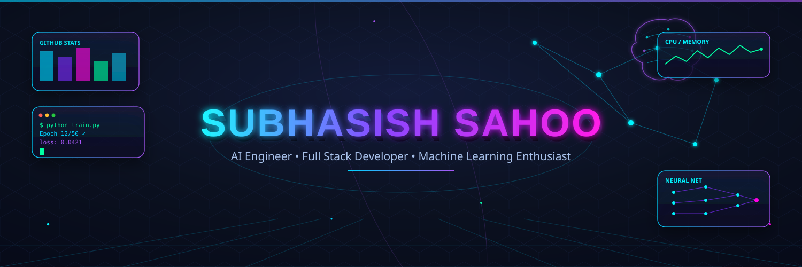

<div align="center">

<!-- ================= HERO BANNER (3D) ================= -->


<!-- ================= ANIMATED TYPING TEXT ================= -->
<a href="https://git.io/typing-svg">
  
</a>

<!-- ================= PROFILE VIEWS / SOCIAL COUNTERS ================= -->
<p>
  
  
  
</p>

</div>
<!-- ================= ABOUT ME ================= -->
<div align="center">

#  About Me


</div>


### 👨‍💻 Developer Profile

```yaml
Name:          Subhasish Sahoo
Role:          AI & Software Developer
Location:      India 🇮🇳

Current Focus:
  - Large Language Models (LLMs)
  - Generative AI
  - AI Agents
  - Full Stack Development

Currently Building:
  - AI Applications
  - Intelligent Automation
  - Developer Tools

Mission:
  Build AI products that solve real-world problems
  and impact millions of people.

Status:
  Learning • Building • Improving • Shipping
```

<!-- ================= TECH STACK ================= -->
## 🛠️ Tech Stack

<details open>
<summary><b>💻 Programming Languages</b></summary>
<br>
<div align="center">

</div>
</details>

<details open>
<summary><b>🎨 Frontend</b></summary>
<br>
<div align="center">

</div>
</details>

<details open>
<summary><b>⚙️ Backend</b></summary>
<br>
<div align="center">

</div>
</details>

<details open>
<summary><b>🤖 Machine Learning</b></summary>
<br>
<div align="center">


</div>
</details>

<details open>
<summary><b>✨ Generative AI</b></summary>
<br>
<div align="center">


</div>
</details>

<details open>
<summary><b>🗄️ Databases</b></summary>
<br>
<div align="center">

</div>
</details>

<details open>
<summary><b>☁️ Cloud & Tools</b></summary>
<br>
<div align="center">

</div>
</details>

---
<div align="center">


<br><br>


</div>

---

<!-- ================= CURRENT FOCUS ================= -->
## 🎯 Current Focus

<table align="center">
<tr>
<td align="center" width="200">🧬<br><b>Transformers</b></td>
<td align="center" width="200">🧠<br><b>LLMs</b></td>
<td align="center" width="200">🌌<br><b>Generative AI</b></td>
<td align="center" width="200">🔍<br><b>RAG</b></td>
</tr>
<tr>
<td align="center" width="200">🤝<br><b>AI Agents</b></td>
<td align="center" width="200">🕸️<br><b>LangGraph</b></td>
<td align="center" width="200">🔌<br><b>MCP</b></td>
<td align="center" width="200">⚙️<br><b>LLMOps</b></td>
</tr>
</table>

---


<!-- ================= ACHIEVEMENTS ================= -->
## 🏅 Achievements

<div align="center">

📅 **Daily Learner** &nbsp;|&nbsp; 🌐 **Open Source Enthusiast** &nbsp;|&nbsp; 🤖 **Building AI Projects**
<br>
✨ **Loves Clean Code** &nbsp;|&nbsp; 🚀 **Startup Builder**

</div>

---

<!-- ================= GITHUB METRICS ================= -->
## 📈 GitHub Metrics

<div align="center">


</div>

---

<div align="center">


### 🛰️ Communication Channel Active
### 🌍 Worldwide Collaboration
### 🚀 Open Source Mission
### ⭐ Connect Below

<br>

<a href="https://github.com/SubhasishOmnify-HQ" target="_blank">
  
</a>

<a href="subhasish-sahoo-92b714418/" target="_blank">
  
</a>

<a href="YOUR_INSTAG" target="_blank">
  
</a>

<a href="mailto:subhasishsahoo4747@gmail.com">
  
</a>

</div>

---

<!-- ================= FOOTER (ANIMATED, MATCHES BANNER) ================= -->
<p align="center">


<p align="center">


</p>


